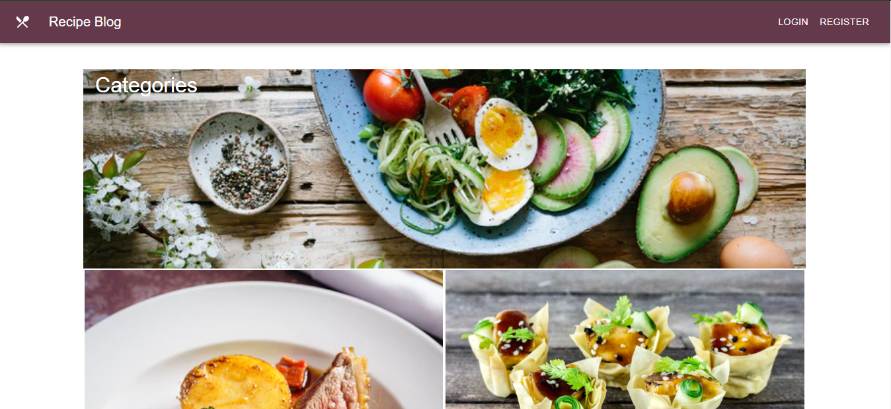

 
  
<h1 align="center">Full Stack Projects</h1>

<table>
    <thead>
        <tr>
            <td>Project Name</td>
            <td>Repo Link</td>
            <td>App Link</td>
            <td>Overview</td>
        </tr>
    </thead>
    <tbody> 
        <tr>
            <td>Medium Clone MERN</td>
            <td><a href="https://github.com/nurkocar/medium-mern-project" target="_blank">Repo details</a></td>
            <td><a href="https://medium-mern-clone.herokuapp.com/" target="_blank">Click here to see the project</a></td>
            <td></td> 
        </tr>
        <tr>
            <td>Recipe Blog   Backend-DJANGO   Frontend-REACT   ( In Progress )</td>
            <td><a href="https://github.com/nurkocar/BlogProject-Frontend-React" target="_blank">Repo details</a></td>
            <td>
            <a href="https://recipe-blog-django-backend.herokuapp.com/" target="_blank">Click here to check backend</a>
             
            <a href="https://myrecipeblog.herokuapp.com/" target="_blank">Click here to check frontend</a></td>
            <td></td> 
        </tr>
        
</tbody>
</table>

